# design-md catalog

> The largest curated open catalog of real-brand `DESIGN.md` files for AI coding agents.

**254 production design systems** extracted from real marketing sites — Linear, Vercel, Stripe, Anthropic, Apple, Tesla, Spotify, Netflix, and more — written to the open [DESIGN.md/v1.5](./SPEC.md) spec so AI agents (Claude, Cursor, Cline, GitHub Copilot, v0, Lovable) can read them as the visual source of truth.

```bash
# Drop any one into your repo in seconds
npx @webdesignhot/design-md add linear   # writes ./DESIGN.md
```

[**Browse all 254 →**](https://www.webdesignhot.com/design.md/) · [**Install the CLI**](https://www.npmjs.com/package/@webdesignhot/design-md) · [**MCP server**](https://www.npmjs.com/package/@webdesignhot/design-md-mcp)

---

## Why this exists

Coding agents need a *file* that captures a brand's design system — colors, typography, spacing, components, motion, accessibility — in plain text they can read on every prompt. [Google Labs](https://github.com/google-labs-code/design.md) defined the v1 spec. We:

1. **Extracted 254 real brands** from production marketing sites (not invented "vibes")
2. **Extended the spec to v1.5** with four sections every agent eventually asks about: Motion, Accessibility, Voice, Dark Mode
3. **Open-sourced the entire catalog** so any AI agent, IDE, or design tool can consume it

vs the alternatives:
- [VoltAgent/awesome-design-md](https://github.com/VoltAgent/awesome-design-md) — 70 brands, MIT (we built on top of their work for ~30 brands; see attribution in each file's `lineage` block)
- [designdotmd.directory](https://designdotmd.directory) — 216 mostly AI-generated "vibe" entries, single author, closed source

## 25 multi-theme entries — real `light + dark` from production

These brands ship both modes on their actual sites. Each PNG below is a Kitchen Sink rendering of the brand's tokens in both themes — same skeleton (nav + display headline + buttons + cards), only the design tokens swap. Click any to open the live preview.

| | | |
|---|---|---|
| <a href="https://www.webdesignhot.com/design.md/agentkit/">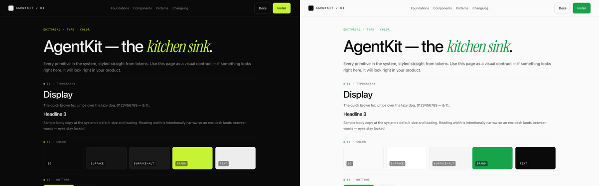</a><br/>**AgentKit** · 3 themes ⭐ | <a href="https://www.webdesignhot.com/design.md/shadcn-ui/">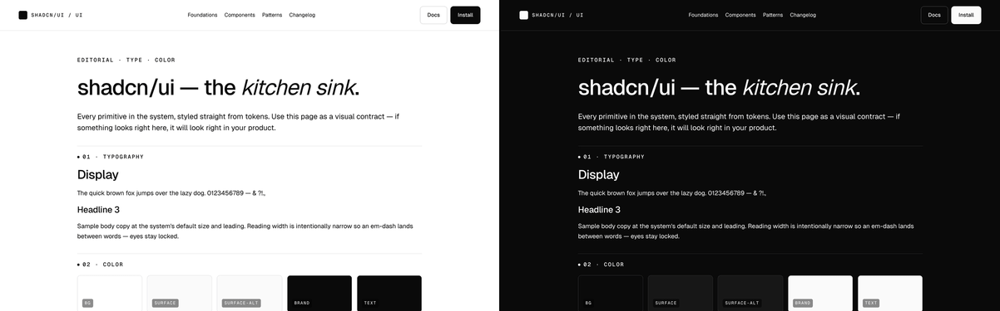</a><br/>**shadcn/ui** | <a href="https://www.webdesignhot.com/design.md/vercel/">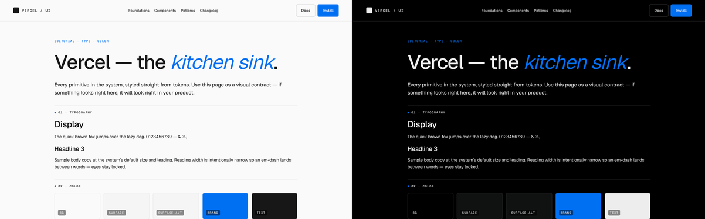</a><br/>**Vercel** |
| <a href="https://www.webdesignhot.com/design.md/tailwindcss/">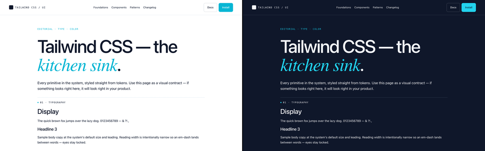</a><br/>**Tailwind CSS** | <a href="https://www.webdesignhot.com/design.md/github/">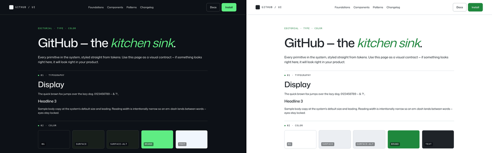</a><br/>**GitHub** | <a href="https://www.webdesignhot.com/design.md/v0-app/">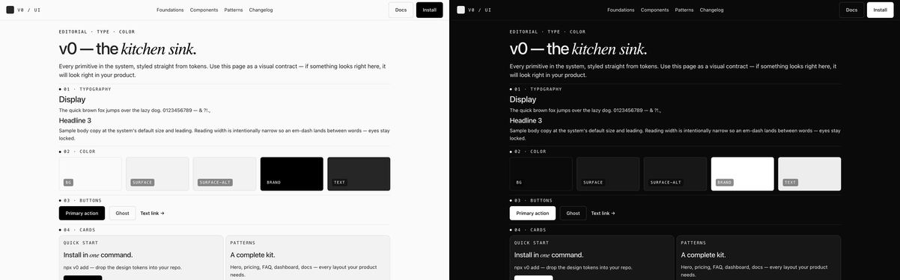</a><br/>**v0** |
| <a href="https://www.webdesignhot.com/design.md/cursor/">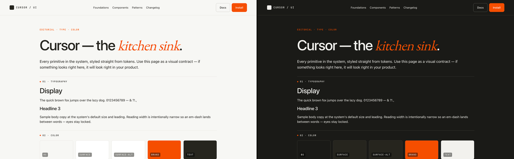</a><br/>**Cursor** | <a href="https://www.webdesignhot.com/design.md/nuxt/">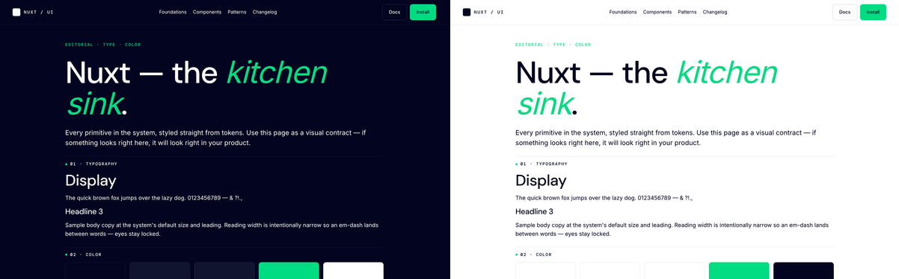</a><br/>**Nuxt** | <a href="https://www.webdesignhot.com/design.md/turbo/">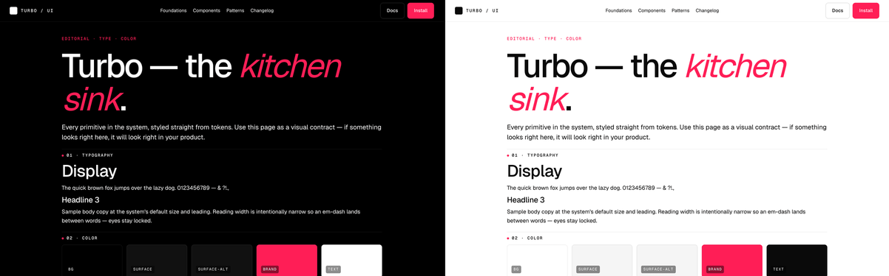</a><br/>**Turbo** |
| <a href="https://www.webdesignhot.com/design.md/astro/">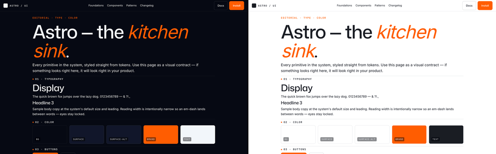</a><br/>**Astro** | <a href="https://www.webdesignhot.com/design.md/qwik/">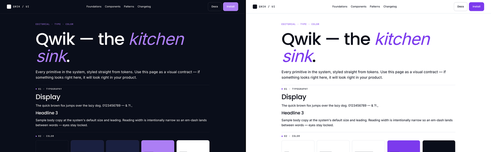</a><br/>**Qwik** | <a href="https://www.webdesignhot.com/design.md/solid-js/">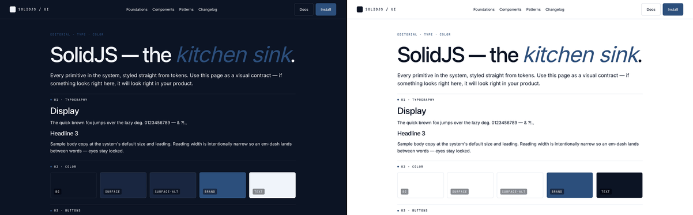</a><br/>**SolidJS** |
| <a href="https://www.webdesignhot.com/design.md/framer/">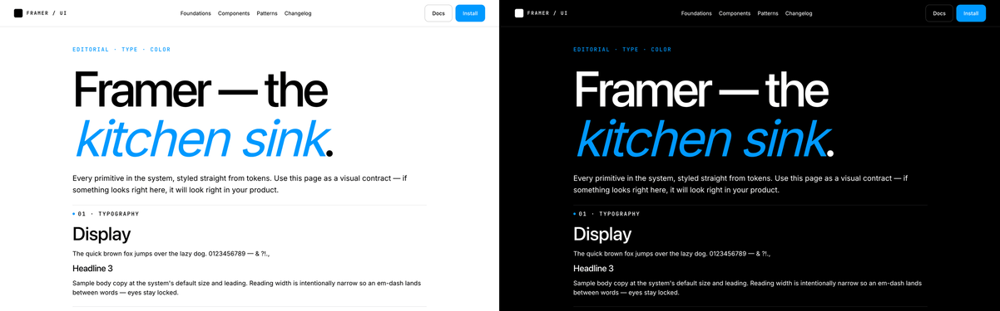</a><br/>**Framer** | <a href="https://www.webdesignhot.com/design.md/midjourney/">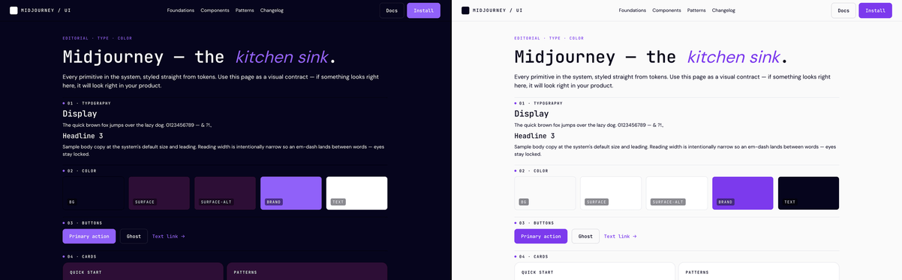</a><br/>**Midjourney** | <a href="https://www.webdesignhot.com/design.md/krea/">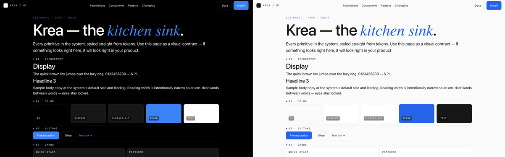</a><br/>**Krea** |
| <a href="https://www.webdesignhot.com/design.md/elevenlabs/">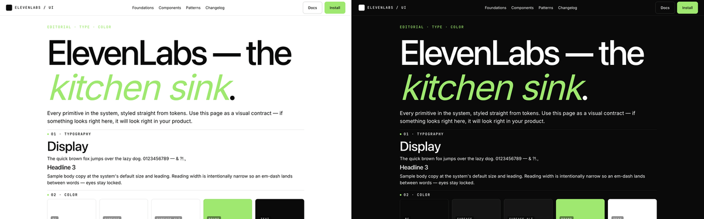</a><br/>**ElevenLabs** | <a href="https://www.webdesignhot.com/design.md/lovable-dev/">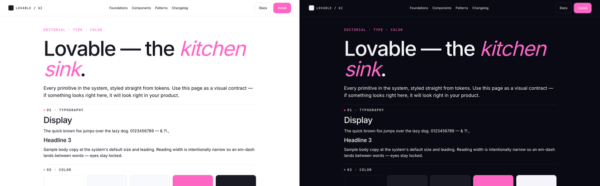</a><br/>**Lovable** | <a href="https://www.webdesignhot.com/design.md/replicate/">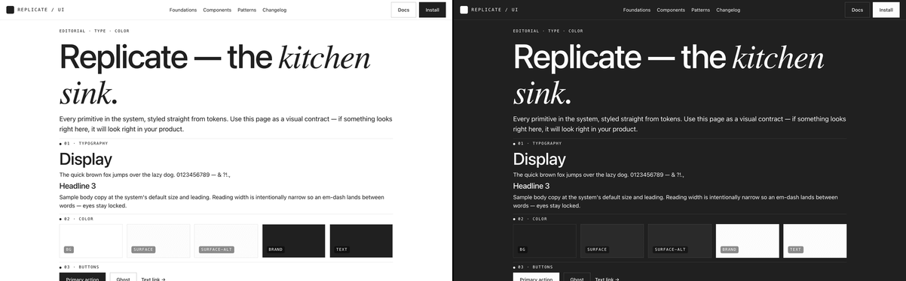</a><br/>**Replicate** |
| <a href="https://www.webdesignhot.com/design.md/together-ai/">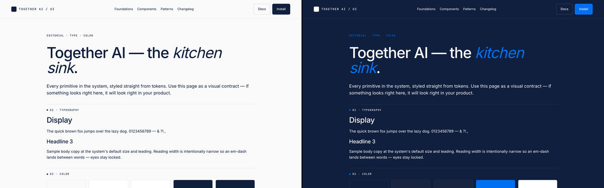</a><br/>**Together AI** | <a href="https://www.webdesignhot.com/design.md/gemini-google/">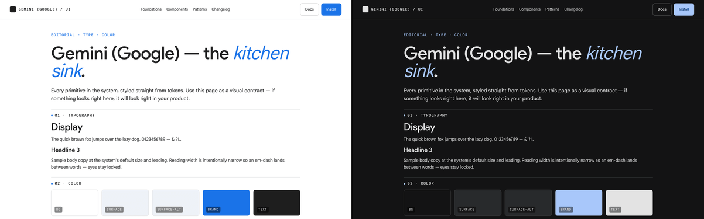</a><br/>**Gemini** | <a href="https://www.webdesignhot.com/design.md/omnivore/">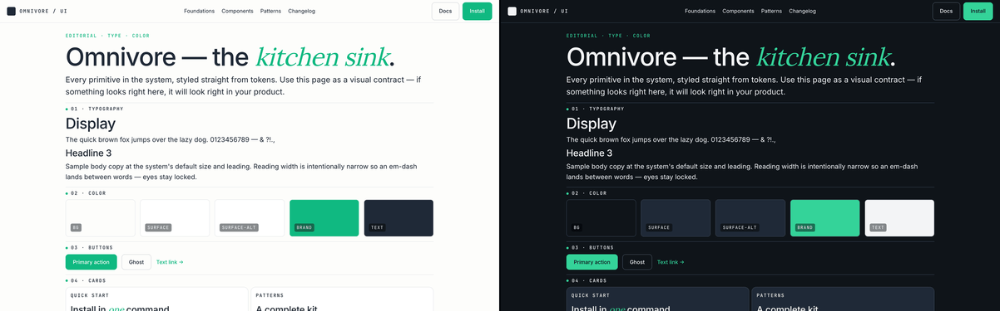</a><br/>**Omnivore** |
| <a href="https://www.webdesignhot.com/design.md/beehiiv/">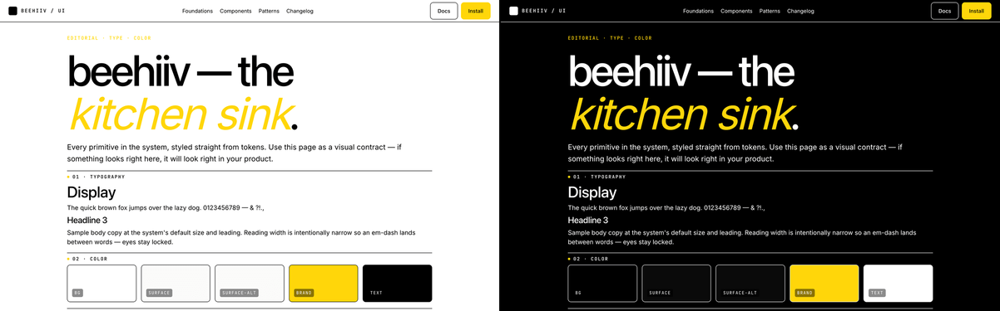</a><br/>**beehiiv** | <a href="https://www.webdesignhot.com/design.md/bluesky/">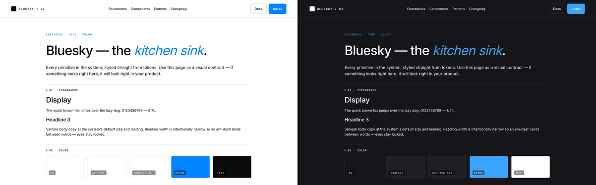</a><br/>**Bluesky** | <a href="https://www.webdesignhot.com/design.md/signal-app/">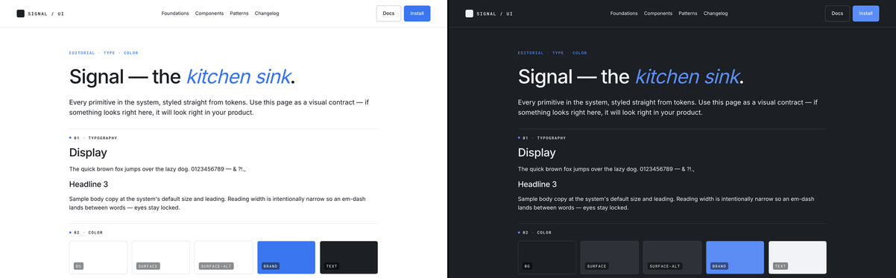</a><br/>**Signal** |
| <a href="https://www.webdesignhot.com/design.md/kit-com/">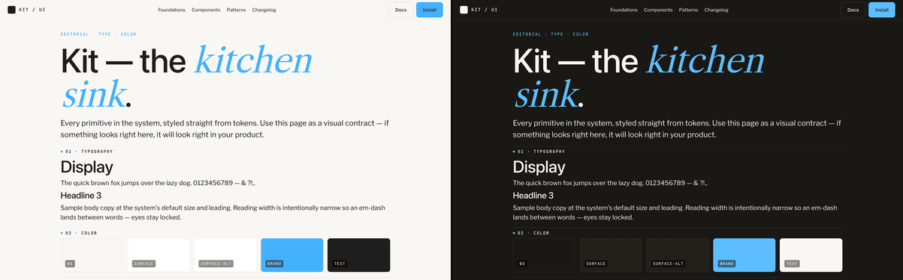</a><br/>**Kit** | | |

The remaining 229 entries ship a single canonical theme — that's how the brand designs at the source. We don't synthesize a fake light Linear or fake dark Stripe to pad the multi-theme count.

## Catalog structure

```
design-md/
├── linear.md          # Linear's design system, v1.5 spec
├── stripe.md          # Stripe's design system, v1.5 spec
├── anthropic.md
├── ...                # 254 entries total
└── webdesignhot.md    # The catalog's own site
```

Each file: YAML frontmatter (machine-readable token bundle) + 15 numbered prose sections (human-readable principles).

## How to use one

**Option 1 — CLI** (one command):
```bash
npx @webdesignhot/design-md add linear            # → ./DESIGN.md
npx @webdesignhot/design-md add stripe -o brand.md # custom path
npx @webdesignhot/design-md list                  # browse all 254
```

**Option 2 — MCP server** (in-IDE, for Claude Desktop / Cursor / Cline):
```json
{
  "mcpServers": {
    "design-md": {
      "command": "npx",
      "args": ["-y", "@webdesignhot/design-md-mcp"]
    }
  }
}
```
Then in chat: *"install Stripe's DESIGN.md here"* — your agent does the rest.

**Option 3 — direct download**:
```bash
curl https://raw.githubusercontent.com/WebDesignHot/design-md/main/design-md/linear.md > DESIGN.md
```

**Option 4 — fork this repo** and curate your own.

## Tell your agent to use it

After dropping `DESIGN.md` into your repo, add to `CLAUDE.md` / `.cursorrules` / system prompt:

```
Use DESIGN.md as the source of truth for visual style.
Every component must reuse the color tokens, typography scale,
radius scale, motion timings, and accessibility contrast pairs
declared there. Quote the section number when citing a token
(e.g. "per §3 Typography Rules").
```

## The v1.5 spec

[Read the full spec → `SPEC.md`](./SPEC.md)

15 numbered sections in every file's body:
| # | Section | New in v1.5 |
|---|---------|-------------|
| 1 | Visual Theme & Atmosphere | |
| 2 | Color Palette & Roles | |
| 3 | Typography Rules | |
| 4 | Component Stylings | |
| 5 | Layout Principles | |
| 6 | Shapes & Radius Scale | |
| 7 | Depth & Elevation | |
| **8** | **Interaction & Motion** | ✨ |
| **9** | **Accessibility & A11y** | ✨ |
| 10 | Responsive Behavior | |
| **11** | **Content & Voice** | ✨ |
| **12** | **Dark Mode & Theming** | ✨ |
| 13 | Lineage & Influences | |
| 14 | Do's and Don'ts | |
| 15 | Agent Prompt Guide | |

v1.5 is a strict superset of v1 — every v1-aware tool reads v1.5 files without modification.

## Contributing

We welcome:
- 🆕 **New brands** — add `design-md/{slug}.md` following the v1.5 schema
- 🔧 **Refinements** — better tokens, missing sections, prose improvements
- 🐛 **Corrections** — wrong colors, broken URLs, factual errors

See [CONTRIBUTING.md](./CONTRIBUTING.md) for the workflow + schema validation tools.

## Related

- 🌐 **Web app**: <https://www.webdesignhot.com/design.md/> (browse, preview, search, AI generator)
- 📦 **CLI**: <https://www.npmjs.com/package/@webdesignhot/design-md>
- 🔌 **MCP server**: <https://www.npmjs.com/package/@webdesignhot/design-md-mcp>
- 📜 **Original v1 spec**: <https://github.com/google-labs-code/design.md>
- 🌱 **Inspired by / built on**: <https://github.com/VoltAgent/awesome-design-md>

## License

MIT — use, modify, redistribute freely. See [LICENSE](./LICENSE).

When you reuse a `.md` file, please keep the `lineage` block intact (it credits original brand designers + any third-party files we drew from).

---

Made by [webdesignhot](https://www.webdesignhot.com) — AI-native landing page kits for builders of AI agents, dev tools, and SaaS.
