# design-md catalog

> The largest curated open catalog of `DESIGN.md` files inspired by real production design systems — for AI coding agents.

**480 production design systems** as editorial DESIGN.md files — Linear, Vercel, Stripe, Anthropic, Apple, Tesla, Spotify, Netflix, and more — written to the canonical [webdesignhot/0.2](./SPEC-V0.2.md) catalog profile so AI agents (Claude, Cursor, Cline, GitHub Copilot, v0, Lovable) can read them as the visual source of truth. Legacy `webdesignhot/0.1` files remain accepted for backwards-compatible submissions.

```bash
# Drop any one into your repo in seconds
npx -y @webdesignhot/design-md add stripe   # writes ./DESIGN.md
```

[**Browse all 480 →**](https://www.webdesignhot.com/design.md/) · [**Install the CLI**](https://www.npmjs.com/package/@webdesignhot/design-md) · [**MCP server**](https://www.npmjs.com/package/@webdesignhot/design-md-mcp)

---

## ✨ Contribute your DESIGN.md in one command

Already have a `DESIGN.md` in your repo? `design-md submit` auto-forks this repo, opens a PR, and our GitHub Actions workflow lints + audits it for you — you don't write any git commands.

```bash
$ npx @webdesignhot/design-md submit ./DESIGN.md

✓ Lint passed
→ Forking WebDesignHot/design-md to your-username/design-md
→ Branch: submit/your-brand-x4f2
→ Pushing to your-username/design-md:submit/your-brand-x4f2
→ Opening PR

✓ Submitted.
  https://github.com/WebDesignHot/design-md/pull/47
```

**Three ways to contribute:**

1. **CLI submit** *(easiest)* — `npx @webdesignhot/design-md submit ./DESIGN.md`. Requires [`gh` CLI](https://cli.github.com) installed + authed.
2. **Manual PR** — fork this repo, add your file at `design-md/<slug>.md`, open a PR. Our workflows auto-lint + auto-label by category.
3. **From scratch** — `npx @webdesignhot/design-md extract https://yoursite.com` generates a draft from your live site; review and submit.

Each PR is reviewed within 48h. We accept editorial DESIGN.md files inspired by real production sites (your own product preferred) — see [CONTRIBUTING.md](./CONTRIBUTING.md) for quality bar + [SPEC.md](./SPEC.md) for the full schema.

---

## Why this exists

Coding agents need a *file* that captures a brand's design system — colors, typography, spacing, components, motion, accessibility — in plain text they can read on every prompt. So we built it:

1. **Extracted 480 real brands** from production marketing sites (not invented "vibes")
2. **Designed the webdesignhot/0.2 spec** around what agents actually ask for — Motion, Accessibility, Voice, and Dark Mode as first-class sections, plus typed tokens, prompts, component states, and a rich machine-readable layer
3. **Open-sourced the entire catalog** so any AI agent, IDE, or design tool can consume it

## 29 multi-theme entries — real `light + dark` from production

These brands ship both modes on their actual sites. Each PNG below is a Kitchen Sink rendering of the brand's tokens in both themes — same skeleton (nav + display headline + buttons + cards), only the design tokens swap. Click any to open the live preview.

| | | |
|---|---|---|
| <a href="https://www.webdesignhot.com/design.md/agentkit/">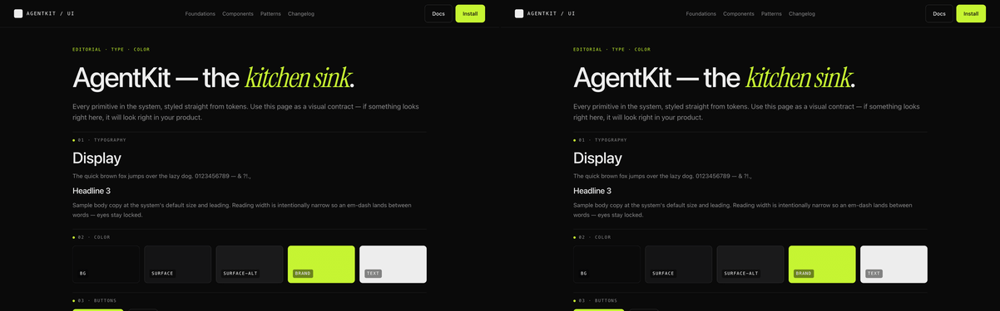</a><br/>**AgentKit** · 3 themes ⭐ | <a href="https://www.webdesignhot.com/design.md/shadcn-ui/">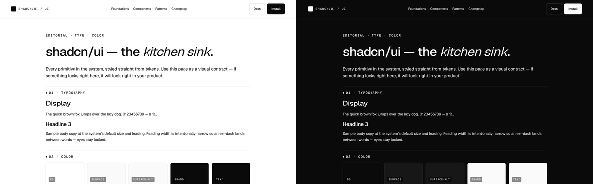</a><br/>**shadcn/ui** | <a href="https://www.webdesignhot.com/design.md/vercel/">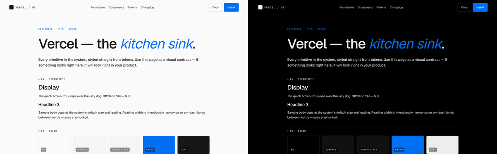</a><br/>**Vercel** |
| <a href="https://www.webdesignhot.com/design.md/tailwindcss/">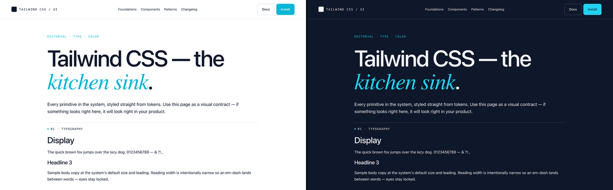</a><br/>**Tailwind CSS** | <a href="https://www.webdesignhot.com/design.md/github/">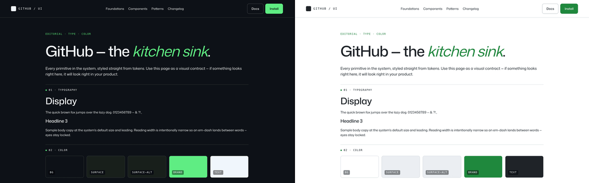</a><br/>**GitHub** | <a href="https://www.webdesignhot.com/design.md/v0-app/">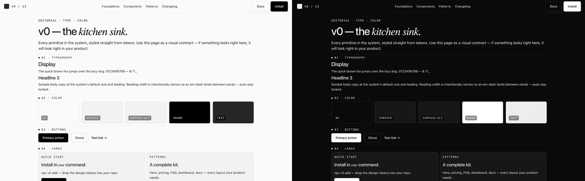</a><br/>**v0** |
| <a href="https://www.webdesignhot.com/design.md/cursor/">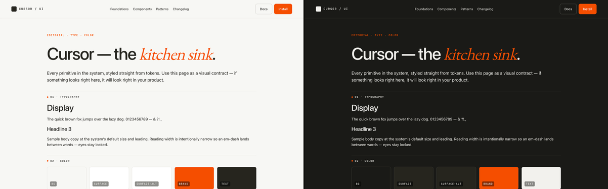</a><br/>**Cursor** | <a href="https://www.webdesignhot.com/design.md/nuxt/">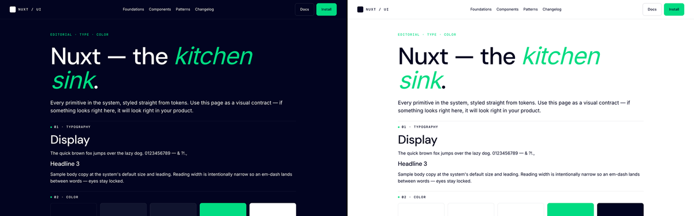</a><br/>**Nuxt** | <a href="https://www.webdesignhot.com/design.md/turbo/">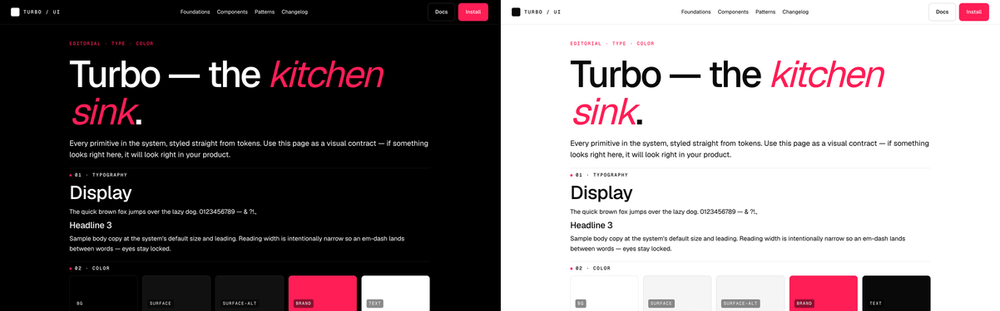</a><br/>**Turbo** |
| <a href="https://www.webdesignhot.com/design.md/astro/">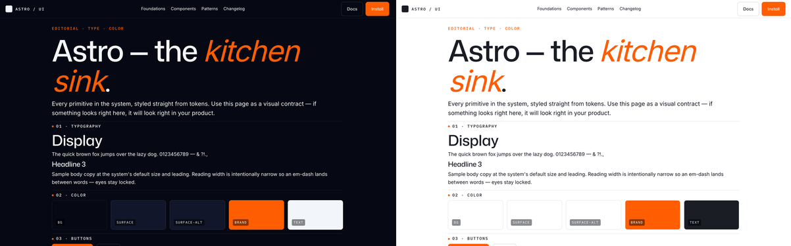</a><br/>**Astro** | <a href="https://www.webdesignhot.com/design.md/qwik/">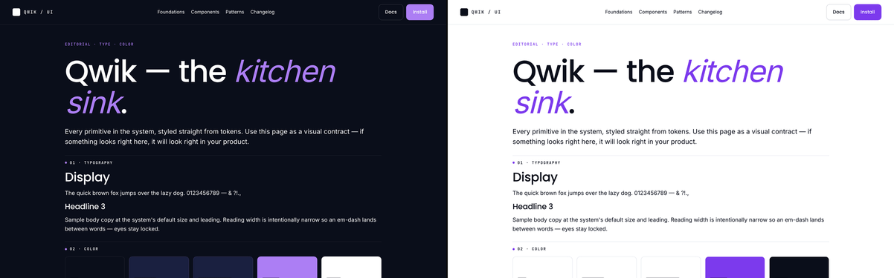</a><br/>**Qwik** | <a href="https://www.webdesignhot.com/design.md/solid-js/">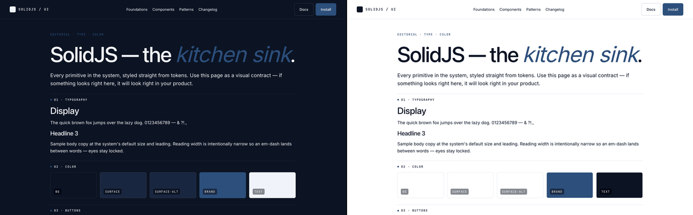</a><br/>**SolidJS** |
| <a href="https://www.webdesignhot.com/design.md/framer/">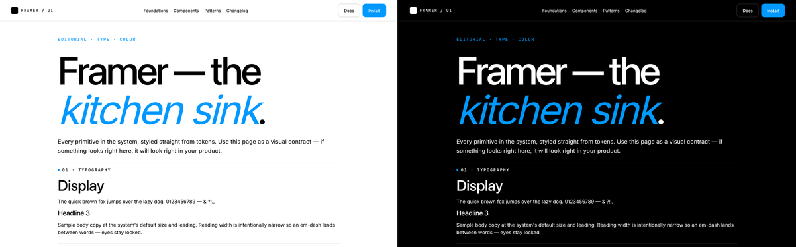</a><br/>**Framer** | <a href="https://www.webdesignhot.com/design.md/midjourney/">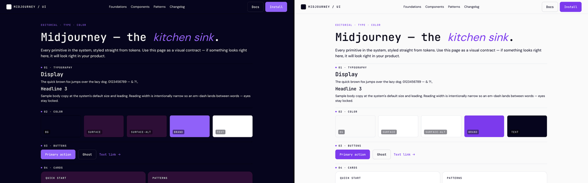</a><br/>**Midjourney** | <a href="https://www.webdesignhot.com/design.md/krea/">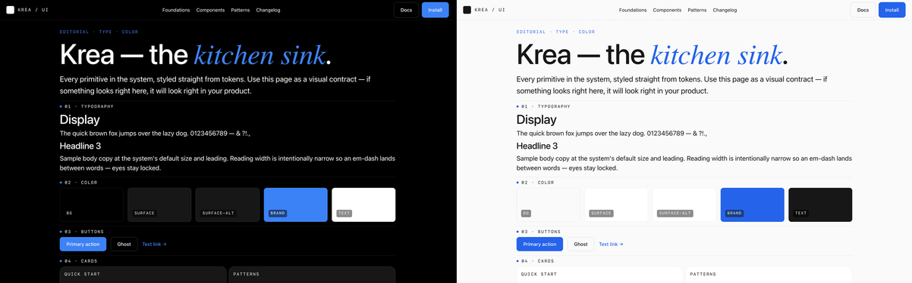</a><br/>**Krea** |
| <a href="https://www.webdesignhot.com/design.md/elevenlabs/">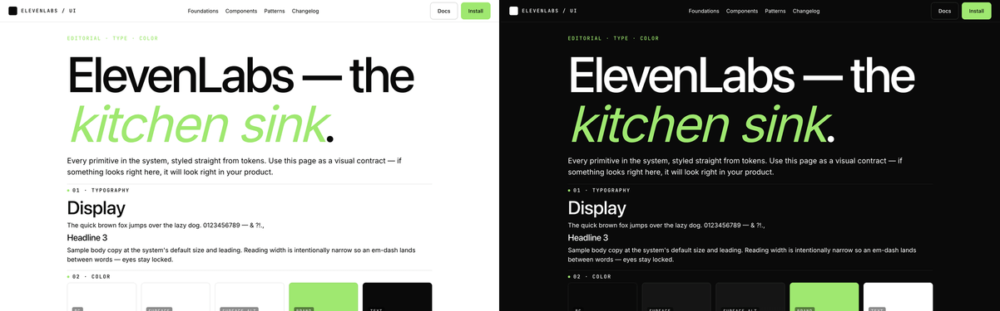</a><br/>**ElevenLabs** | <a href="https://www.webdesignhot.com/design.md/lovable-dev/">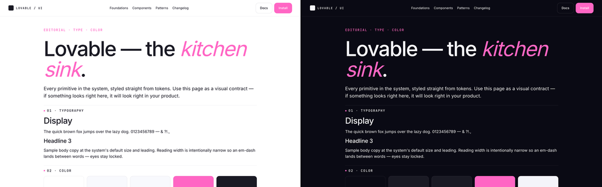</a><br/>**Lovable** | <a href="https://www.webdesignhot.com/design.md/replicate/">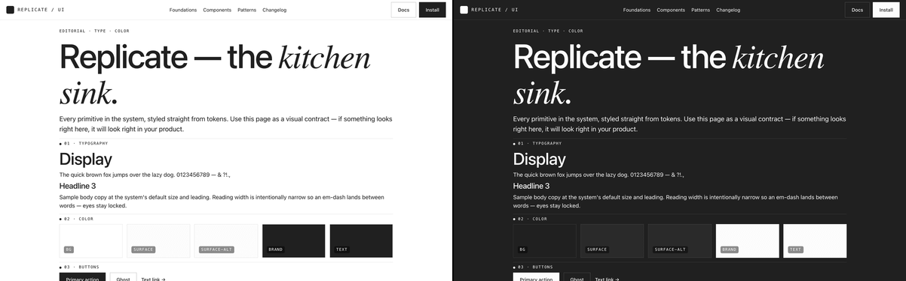</a><br/>**Replicate** |
| <a href="https://www.webdesignhot.com/design.md/together-ai/">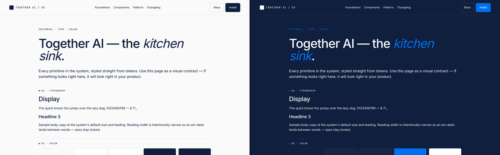</a><br/>**Together AI** | <a href="https://www.webdesignhot.com/design.md/gemini-google/">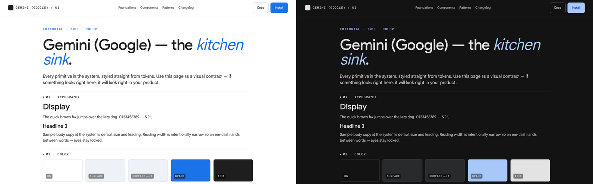</a><br/>**Gemini** | <a href="https://www.webdesignhot.com/design.md/omnivore/">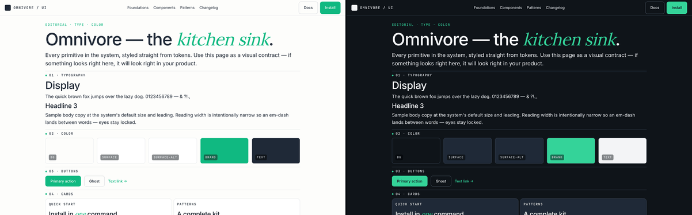</a><br/>**Omnivore** |
| <a href="https://www.webdesignhot.com/design.md/beehiiv/">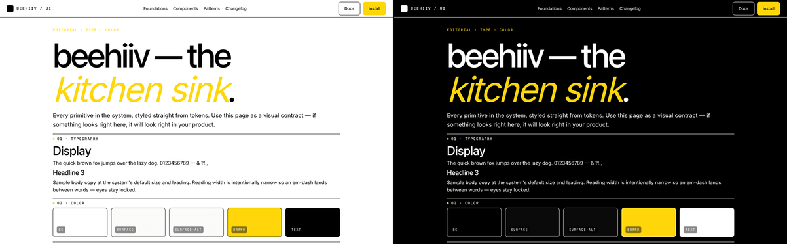</a><br/>**beehiiv** | <a href="https://www.webdesignhot.com/design.md/bluesky/">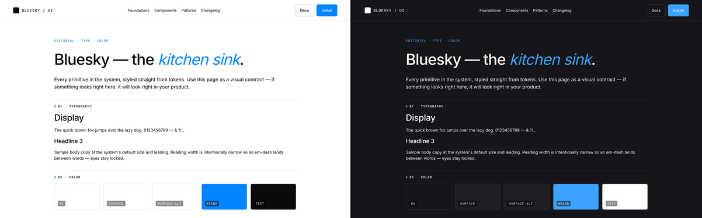</a><br/>**Bluesky** | <a href="https://www.webdesignhot.com/design.md/signal-app/">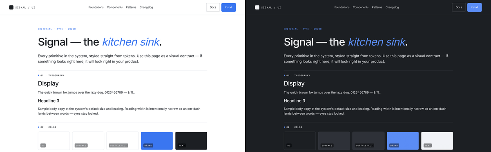</a><br/>**Signal** |
| <a href="https://www.webdesignhot.com/design.md/kit-com/">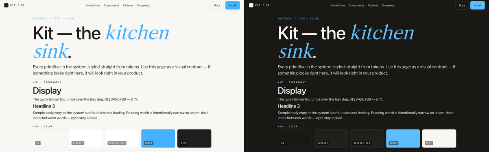</a><br/>**Kit** | <a href="https://www.webdesignhot.com/design.md/glif/">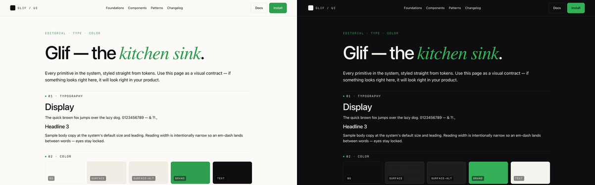</a><br/>**Glif** | <a href="https://www.webdesignhot.com/design.md/netlify/">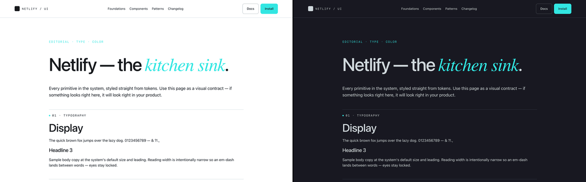</a><br/>**Netlify** |
| <a href="https://www.webdesignhot.com/design.md/picoko/">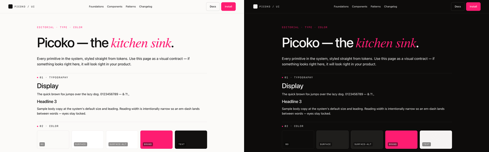</a><br/>**Picoko** | <a href="https://www.webdesignhot.com/design.md/storybook/">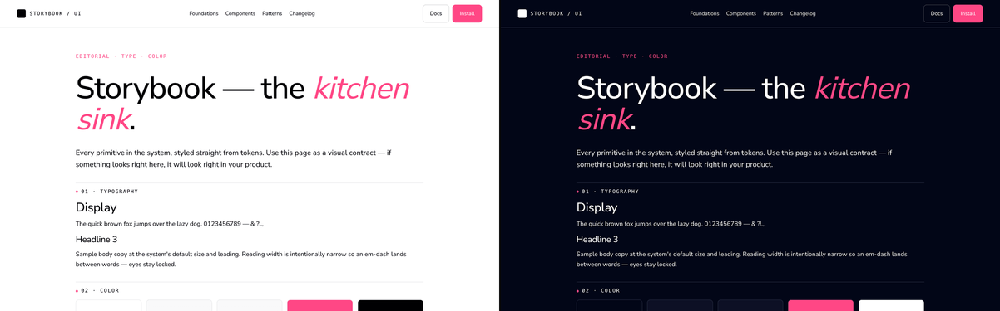</a><br/>**Storybook** | |

The catalog currently contains 39 entries with explicit named theme sets; 29 are showcased above. Other entries may expose optional light/dark token groups without inventing an unsupported mode.

## Catalog structure

```
design-md/
├── stripe.md          # Stripe's design system, webdesignhot/0.2 catalog profile
├── linear.md          # Linear's design system, webdesignhot/0.2 catalog profile
├── anthropic.md
├── ...                # 480 entries total
└── webdesignhot.md    # The catalog's own site
```

Each file: YAML frontmatter (machine-readable token bundle) + 15 numbered prose sections (human-readable principles). Current entries declare `spec: webdesignhot/0.2` and `profile: catalog`.

## How to use one

**Option 1 — CLI** (one command):
```bash
npx -y @webdesignhot/design-md add stripe             # → ./DESIGN.md
npx -y @webdesignhot/design-md add linear -o brand.md # custom path
npx -y @webdesignhot/design-md list                   # browse all 480
```

<details>
<summary><b>All CLI commands</b></summary>

```
add <slug> [-o, --out <path>] [-f, --force]
  Write the chosen DESIGN.md to your CWD.

list
  Print the full catalog (slug · name · tags).

category [name]
  Without a name, lists every category with a count.
  With a name, lists every design in that category.

init
  Interactive picker (default if no command given).

lint <file-or-directory> [--strict] [--spec auto|0.1|0.2] [--compat google-alpha] [--format=text|json]
  Validate a DESIGN.md for spec compliance, metadata, relationships, and
  optional Google portability.

diff <a> <b> [--format=text|json]
  Token-level diff between two DESIGN.md files.

export <file> --to <tailwind|css-tailwind|json-tailwind|css|dtcg|figma|google-alpha>
  Convert tokens to one of:
    tailwind   — Tailwind v4 @theme CSS (use --tailwind-version v3 for JSON)
    css-tailwind — explicit Tailwind v4 @theme alias
    json-tailwind — Tailwind v3 theme JSON alias
    css        — :root { --color-bg, --radius-card, … }
    dtcg       — W3C Design Tokens Community Group JSON
    figma      — Figma Variables import format
    google-alpha — portable Google DESIGN.md Alpha output with a loss report

extract <url> [-o <path>] [--token-only]
  Extract a draft DESIGN.md from any production URL.
  (Requires a webdesignhot session — opens the browser flow.)

theme <slug> [--dark|--light]
  Compute a dark/light variant of any design.

upgrade <file-or-directory> --to webdesignhot/0.2 [--write] [--format=json]
  Dry-run by default; only deterministic version/profile changes are made.

submit <file> [--dry-run]
  Validate and open a contribution PR. Both v0.1 and v0.2 submissions work.

preview <slug>
  Open the directory detail page in your browser.

help
  Print the full command list.
```

Install globally if you'd rather skip `npx`:

```bash
npm i -g @webdesignhot/design-md
design-md add stripe
```

Requires Node 18+.

</details>

**Option 2 — MCP server** (in-IDE, for Claude Desktop / Cursor / Cline):

```json
{
  "mcpServers": {
    "design-md": {
      "command": "npx",
      "args": ["-y", "@webdesignhot/design-md-mcp"]
    }
  }
}
```

Then in chat: *"install Stripe's DESIGN.md here"* — your agent does the rest.

<details>
<summary><b>All MCP tools</b></summary>

The MCP server exposes 8 tools any compliant agent can call:

| Tool | What it does |
|---|---|
| `list_designs` | List every design with optional `featured_only` / `category` / `tag` filters |
| `get_design` | Fetch the full DESIGN.md (v0.2 or legacy v0.1) source; optionally include resolved tokens |
| `search_designs` | Fuzzy search by name, tagline, tags, categories |
| `diff_designs` | Token-level diff between any two designs |
| `export_design` | Render tokens to tailwind / css / dtcg / figma / google-alpha |
| `get_component` | Resolve a v0.2 component variant, state, and size |
| `evaluate_token` | Evaluate a safe v0.2 color reference or expression |
| `install_design` | Get the npx command + raw markdown to install one |

Try it once connected:

> *"List the top 10 dark editorial design systems."*
>
> *"Install Stripe's DESIGN.md into this project."*
>
> *"Diff Linear and Vercel — what changes if I switch?"*
>
> *"Export Anthropic's tokens as Tailwind config."*

Cursor users: Settings → Features → MCP → "Add new MCP server" → Type `command`, Command `npx -y @webdesignhot/design-md-mcp`.

Cline / Roo / any stdio-MCP client: same `npx -y @webdesignhot/design-md-mcp` command works.

</details>

**Option 3 — direct download**:

```bash
curl https://raw.githubusercontent.com/WebDesignHot/design-md/main/design-md/stripe.md > DESIGN.md
```

**Option 4 — fork this repo** and curate your own.

## Tell your agent to use it

After dropping `DESIGN.md` into your repo, add to `CLAUDE.md` / `.cursorrules` / system prompt:

```
Use DESIGN.md as the source of truth for visual style.
Every component must reuse the color tokens, typography scale,
radius scale, motion timings, and accessibility contrast pairs
declared there. Quote the section number when citing a token
(e.g. "per §3 Typography Rules").
```

## The webdesignhot/0.2 spec

[Read the full spec → `SPEC-V0.2.md`](./SPEC-V0.2.md)

`SPEC.md` remains the compatibility reference for legacy v0.1 input. The
canonical catalog uses `spec: webdesignhot/0.2` and `profile: catalog`. The CLI
can export a portable Google view with `--to google-alpha`; that output uses
`version: alpha` and includes an explicit loss report for catalog-only fields.

15 numbered sections in every file's body:

| # | Section | Signature focus |
|---|---------|-------------|
| 1 | Visual Theme & Atmosphere | |
| 2 | Color Palette & Roles | |
| 3 | Typography Rules | |
| 4 | Component Stylings | |
| 5 | Layout Principles | |
| 6 | Shapes & Radius Scale | |
| 7 | Depth & Elevation | |
| **8** | **Interaction & Motion** | ✨ |
| **9** | **Accessibility & A11y** | ✨ |
| 10 | Responsive Behavior | |
| **11** | **Content & Voice** | ✨ |
| **12** | **Dark Mode & Theming** | ✨ |
| 13 | Lineage & Influences | |
| 14 | Do's and Don'ts | |
| 15 | Agent Prompt Guide | |

webdesignhot/0.2 is our own catalog profile — one Markdown file any tool or
agent can read, with a richer typed token layer and the same 15 prose sections.
See [`SPEC-V0.2.md`](./SPEC-V0.2.md) for the normative schema and
[`SPEC.md`](./SPEC.md) for the legacy v0.1 compatibility baseline.

## Contributing

We welcome:
- 🆕 **New brands** — add `design-md/{slug}.md` following the webdesignhot/0.2 catalog profile (v0.1 is still accepted)
- 🔧 **Refinements** — better tokens, missing sections, prose improvements
- 🐛 **Corrections** — wrong colors, broken URLs, factual errors

See [CONTRIBUTING.md](./CONTRIBUTING.md) for the workflow + schema validation tools.

## Related

- 🌐 **Web app**: <https://www.webdesignhot.com/design.md/> (browse, preview, search, AI generator)
- 📦 **CLI**: <https://www.npmjs.com/package/@webdesignhot/design-md>
- 🔌 **MCP server**: <https://www.npmjs.com/package/@webdesignhot/design-md-mcp>

## License

MIT — use, modify, redistribute freely. See [LICENSE](./LICENSE).

When you reuse a `.md` file, please keep the `lineage` block intact (it credits original brand designers + any third-party files we drew from).

---

Made by [webdesignhot](https://www.webdesignhot.com) — AI-native landing page kits for builders of AI agents, dev tools, and SaaS.
